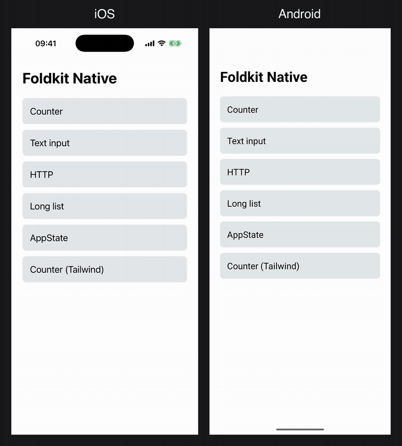

# foldkit-native

**[Foldkit](https://github.com/foldkit/foldkit) apps drawing real native iOS and Android views, with no React in the render path.**



> [!WARNING]
> **This is an experiment, not a product.** It was vibe-coded, mostly by AI agents, to answer one question: *can a Foldkit app drive React Native's Fabric renderer directly?* The answer looks like yes. The code is disposable, the APIs will change, and nothing here is published to a registry. Please don't build on it.

## How it works

A Foldkit app is The Elm Architecture on [Effect](https://effect.website): a Model, Messages, an `update`, and a `view` that returns virtual DOM. On the web, Foldkit's vendored [snabbdom](https://github.com/snabbdom/snabbdom) patches that virtual DOM into the browser DOM. Here it is patched into native views instead:

```
Foldkit view ─▶ snabbdom patch ─▶ Fabric Platform ─▶ @ng-native/fabric Engine ─▶ Fabric (native views)
```

- **A Platform seam in Foldkit.** A [fork](https://github.com/giovannilondero/foldkit/tree/platform-seam) adds a `platform` option (`{ domApi, modules, requestFrame }`) to `makeElement`/`makeApplication`, so the renderer can target something other than the DOM. It is about 250 lines, shaped so it could become an upstream PR.
- **The Fabric Platform** (`packages/foldkit-native`) implements snabbdom's DOM API and modules on top of the Engine from [ng-native](https://github.com/ng-native/ng-native)'s `@ng-native/fabric`, which talks to React Native's Fabric UI manager. React stays in the bundle only because React Native's own JS imports it. No React reconciler runs.
- **A typed view builder** `n` (`n.view`, `n.text`, `n.pressable`, `n.scrollView`, `n.textInput`) with React Native-named attributes and inline styles, or Tailwind classes.

```ts
const view = (model: Model, n: NativeBuilder<Message>): Html =>
  n.view(
    [n.Style({ flex: 1, alignItems: 'center', justifyContent: 'center', gap: 24 })],
    [
      n.text([n.Style({ fontSize: 48, fontWeight: '700' })], [`Count: ${model.count}`]),
      n.pressable([n.OnPress(Message.ClickedIncrement())], [n.text([], ['+'])]),
    ],
  )
```

## What works

Verified by hand on an iOS simulator (iOS 26.5) and an Android emulator (API 36), on an Expo SDK 57 dev client with the New Architecture and Hermes:

| Demo | What it shows |
|---|---|
| Counter | Press handling, one native commit per frame |
| Text input | A controlled field the Model rewrites (uppercase) without dropping keystrokes or moving the cursor |
| Long list | 1,000 keyed rows in a plain scroll view; prepend and remove keep native view identity |
| HTTP | An Effect `HttpClient` Command with loading, success and network-error states |
| AppState | A Foldkit Subscription over React Native's `AppState` |
| Counter (Tailwind) | Styling through Tailwind classes, including `dark:` and `active:` |

Effect 4 and Foldkit run on Hermes with **no polyfills**.

What doesn't work, or was never attempted: navigation, animations and gestures, Foldkit's browser-only effects (routing, focus, scroll lock, …), devtools on a device, and Expo Go. The [Spike spec](./docs/spike-spec.md) records every decision, deviation and known limitation.

## Try it

You need Xcode and/or Android Studio, Node 22+, and pnpm.

```sh
git clone --recurse-submodules https://github.com/giovannilondero/foldkit-native.git
cd foldkit-native
pnpm install
pnpm build
pnpm test            # Node tests on a fake Fabric

cd apps/spike
pnpm prebuild
pnpm ios             # or: pnpm android
```

More detail, including pitfalls, is in [apps/spike/README.md](./apps/spike/README.md).

## Layout

- `vendor/foldkit/`: git submodule, the Foldkit fork at branch `platform-seam`.
- `packages/foldkit-native/`: the Fabric Platform, `registerApp`, the `n` view builder, the AppState subscription and the CSS/Tailwind glue. Design notes in [`docs/`](./packages/foldkit-native/docs/).
- `apps/spike/`: the Expo dev client with the demo menu.
- [`CONTEXT.md`](./CONTEXT.md): the vocabulary used throughout.

## Thanks

This only took days because of the work of others:

- **[Foldkit](https://github.com/foldkit/foldkit)** by Devin Jameson: a lovely Elm-style framework whose clean boundaries made a Platform seam a small change.
- **[ng-native](https://github.com/ng-native/ng-native)** by Ashley Hunter: `@ng-native/fabric` proved Fabric can be driven without React, and did the hardest part. Its test utilities and Tailwind pipeline are reused here.
- **[React Native](https://reactnative.dev)** and the Fabric renderer, by Meta and the community.
- **[Expo](https://expo.dev)**: the dev client, prebuild and Metro setup made two platforms painless.
- **[Effect](https://effect.website)** and **[snabbdom](https://github.com/snabbdom/snabbdom)**, which Foldkit stands on.

See also [Manzanita-Research/foldkit-native](https://github.com/Manzanita-Research/foldkit-native), an unrelated experiment with the same name that draws Foldkit apps through GPUI.

## License

[MIT](./LICENSE). `packages/foldkit-native/test/fakeFabric.ts` is vendored from ng-native (MIT, Ashley Hunter).
